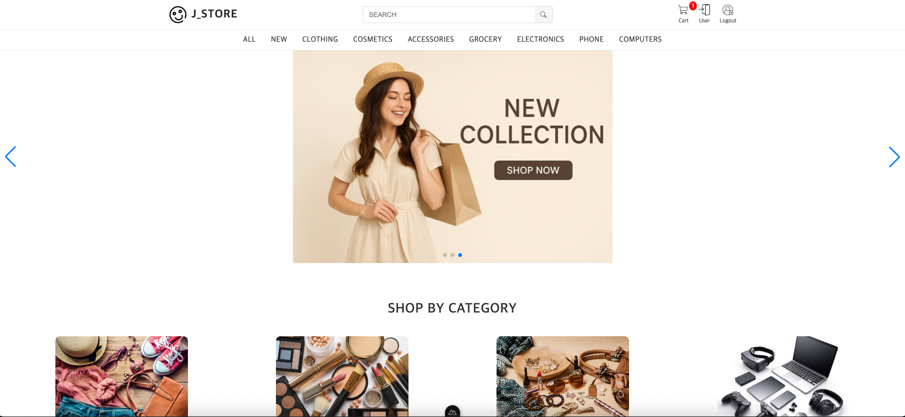

# j-store-front

## 概要
ECサイトを想定したフロントエンドを実装した個人開発プロジェクトです。
Nuxt（Vue.js）を使用し、商品一覧表示からカート追加、購入・決済までの一連の画面UIを構築しました。

## 作成背景・目的
実務において、Nuxt を用いたフロントエンドと Laravel によるバックエンドを組み合わせた
ECサイト構築に携わっている中で、フロントエンド側の実装理解をより深めたいと考え、
本プロジェクトを作成しました。

実務で扱っている構成を意識しながら、
API連携を前提としたSPA構成や、
商品一覧からカート追加、購入・決済までの一連の画面制御を個人開発で繰り返し実装することで、
実装力の向上と理解の定着を目的としています。

## 主な対応内容
- 商品一覧画面の実装
- 商品のカート追加・削除機能
- 購入・決済フローを想定した画面遷移の実装
- モーダルの開閉制御（共通コンポーネント化）
- バックエンドAPIとの連携を想定した画面設計

## 使用技術
### フロントエンド
- Nuxt.js（Vue 3）
- JavaScript / TypeScript
- Vite（Nuxt 3 標準ビルドツール）

### その他
- npm
- Git / GitHub

## 環境構築・起動方法
```bash
git clone https://github.com/qqwqq97/j-store-front.git
cd j-store-front
npm install
npm run dev
```

### バックエンドAPIについて

本プロジェクトは バックエンドAPIと連携するECサイト を想定しており、
バックエンドAPIの起動が必須です。

バックエンドが起動していない場合、
トップページを含む画面が正しく表示されません。

バックエンドのリポジトリおよび起動方法については、
以下をご確認ください。

- バックエンドリポジトリ  
  https://github.com/qqwqq97/j-store-back.git


### アクセス
ローカル起動後、以下のURLで確認できます。
http://localhost:3000

## 画面イメージ

### トップページ



## 工夫した点・課題

### バックエンド連携時のCORS対応

フロントエンド（Nuxt）とバックエンド（Laravel）を分離した構成で開発を進める中で、  
API連携時にCORSエラーが発生し、原因の特定に苦労しました。

リクエストの送信元やヘッダー、  
バックエンド側の設定を一つずつ確認しながら対応を行い、  
フロント・バックエンド双方の仕組みを理解した上で解決しました。

### ログイン状態の保持と画面遷移制御

Nuxtではフロント側の状態（useState）がページリロード時に初期化されるため、  
ログイン後に画面を更新するとユーザー情報が失われる課題がありました。

この問題に対し、  
**全ルート遷移時に自動でユーザー情報を取得するグローバルミドルウェア** を実装し、  
ログイン状態を安定して復元できるように工夫しました。

これにより、  
- 各ページごとの重複した取得処理を回避  
- 画面遷移やリロード時の状態不整合を防止  

することができました。

### 環境構築から設計・実装までを一人で担当した点

本プロジェクトは、  
環境構築から画面設計、実装までを **すべて一人で行った初めての個人開発** でした。

実務では既存コードを参考にしながら開発することが多かったため、  
ゼロから構成を考える点に難しさを感じましたが、  
その分アプリ全体の構造や処理の流れを深く理解する良い経験となりました。

## 関連リポジトリ
- Backend: https://github.com/qqwqq97/j-store-back.git

### 環境変数について

StripeのAPIキーなどの機密情報は、  
環境変数（.env）で管理しています。

※ セキュリティの観点から、  
APIキーはリポジトリには含めていません。

## 今後の改善予定
- 商品検索・絞り込み機能の追加 （キーワード検索、カテゴリ別表示など）
- カート画面での商品数量変更機能の実装（数量変更に応じた合計金額のリアルタイム更新）
- ユーザーダッシュボード機能の追加
 - 注文履歴の確認
 - 配送状況の確認
 - お届け先の追加・削除
 - アカウント設定画面の実装（ユーザー情報の確認・変更）
